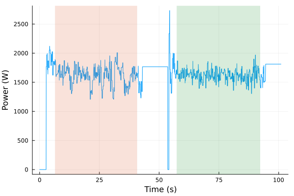

# WAAMTools

This is a julia package that is intended to make the day-to-day data crunching at the university of Alberta WAAM lab a little easier. I haven't gotten around to porting over the pyrometer tools yet, so it's really just a fancy power data import tool for the time being.

My intention is to open up the code I have been using to others. By creating a package, the algorithms can be used in short scripts to automate new tasks.

# Getting Started

As this is a julia package, you will first need to install julia. The easiest way to do this is to follow the instructions at [the julia downloads page](https://julialang.org/downloads/).

You can install the package in your REPL with the following command:

```julia-repl
julia> import Pkg; Pkg.add(https://github.com/Jarrod-Angove/WAAMTools.jl)
```

Once the package is installed, you can launch it in the REPL:

```julia-repl
julia> using WAAMTools
```

You can then start using the functions provided by the package.

## TL;DR

Install julia, launch it, then run the following command in the REPL to find the mean(s) power for a file with the absolute path `path/to/my_power_file.csv`. 

```julia-repl
julia> my_mean = mean(importer("path/to/my_power_file.csv"))
```

The `my_mean` variable will then be a tuple of either one or two objects depending on how many samples were run for this file. If all you want are the mean values associated with each (read below for the other options), you can use the following commands

```julia-repl
julia> mean_sample1 = my_mean[1].summary.mean
julia> mean_sample2 = my_mean[2].summary.mean
```

Please note that these values are the average power [W] input over time, and **do not account for heat transfer efficiency or torch travel speed**. 

## Typical power import

As data for the WAAM system is collected in the form of CSV/xlsx files, it needs to be imported and cleaned up. This can be done with the importer command, which will create a `power_info` object from the given file:

`importer(file, directory)`

Import the power file CSV in `directory` into a `power_file` object, which has the fields:

* `voltage` = the voltage read from the CSV in [V]
* `current` = the current read from the CSV in [A]
* `time` = the time, formatted into seconds, from the CSV
* `file` = the file name input

For example, if you wanted to import the file `Plate18_power.csv`, located in the directory `home/user.../power_files/`, you would input the following in the REPL:

```julia-repl
julia> plate18_data = importer("Plate18_power.csv", "home/user.../power_files/")
```

Once you have a `power_info` object, you can access the components with julia dot notation:

```julia-repl
julia> plate18_data.voltage
```
The above command will return a vector of the voltages stored in `plate18_data`.

Alternatively, you can input the complete file path as a single string to get the same results;

```julia-repl
julia> importer("home/use.../power_files/Plate18_power.csv")
```

Which will return the same data object.

Once you have a `power_info` object from this import, you can do a few things. The main purpose of this package at this time is splitting power data into ranges for taking averages, so the main function is `mean`, which takes one of these objects and does a few things. 

1. Identify stable regions for averaging
2. Calculates the mean and standard deviation of these regions
3. If there are multiple regions (for trials where there are 2 beads on a plate), split the resulting data into individual `sample_power` objects, which contain all information relevant to the sample power calculation. 

Once you have a `sample_power` object, you are basically done! This contains the following fields: 

- `name` → the original file name
- `summary` → a summary of the mean data calculation
    - `ranges` → the selected time range for the mean (in seconds)
    - `mean` → the average power in [w], not including efficiency or tts
    - `nsamples` → the number of samples in the original file (1 or 2)
    - `npoints` → the number of points sampled for this average 
    - `std` → the standard deviation from the mean
- `hotcold` → "c" for cold plate and "h" for hot plate; just to keep track of stuff

In summary, if you wanted to find the average power input for the cold plate data of plate 18, you would use the following commands

```julia-repl
julia> my_mean_data = mean(importer("path/to/data.csv"))
julia> cold_plate_average = my_mean_data[1].summary.mean
```

Likewise, if you wanted to find the standard deviation of the hot plate data:

```julia-repl
julia> hot_plate_std = my_mean_data[2].summary.std
```

or if you forgot which file it came from? 

```julia-repl
julia> my_mean_data.name
```

will return the original file used to generate the object!

## Verifying the selection

You can view what the algorithm is selecting by using the `view_range` function, which plots the power data and the range(s) selected by the algorithm:

```julia-repl
julia> view_range(importer("path/to/Plate15_data.csv"))
```

Which will produce the plot:




